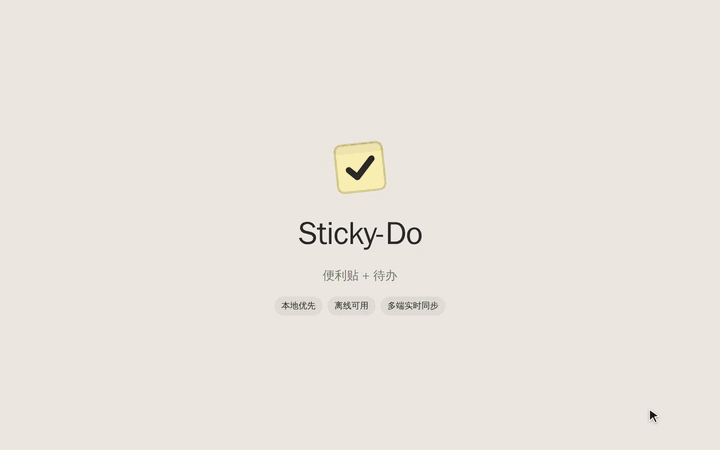

# Sticky-Do

便利贴 + 待办事项应用。第一期为 Go 服务端 + React Web 前端，后期支持 Android 与 iOS。

> 当前进度：Web 版 M1–M5（编辑器、本地优先 + 多端同步、快速记录、待办视图、看板、实时更新、回收站）与 Chrome 插件登录同步（E2）已完成，设计文档见 [docs/](docs/README.md)。

## 演示

[](docs/media/stickydo-demo.mp4)

约 1 分半：双击贴便利贴、拖动换色、Markdown 待办 → 按 Q 快速记录（自动识别时间、优先级、标签）→ 看板 → 今天 / 即将 → Ctrl+K 命令面板 → 白板 / 列表 → 暗色模式 → 两台设备实时同步。点图片可看清晰版 [MP4](docs/media/stickydo-demo.mp4)。

## 本地开发

需要 Go 1.26+、Node 22+、Docker。

前端是 npm workspaces：`packages/core`（Web 与移动端共用、与平台无关的代码）+ `web/`。依赖在仓库根目录安装一次：

```bash
npm install  # 在仓库根目录
make db      # 启动 PostgreSQL + Redis（Docker）
make dev     # 启动 API 服务 :8080（启动时自动执行数据库迁移）
make web     # 另开终端：启动前端 :5173，/api 自动代理到 :8080
```

打开 http://localhost:5173 。不登录也能用白板（数据保存在浏览器里）；右上角注册、登录后，便利贴在多台设备间同步：逐条比较，哪边新以哪边为准（规则见 [architecture.md §5](docs/architecture.md)）。

| 命令 | 作用 |
|---|---|
| `make gen` | 改了 `api/openapi.yaml`、SQL 或设计 token（`packages/core/src/design/tokens.ts`）之后，重新生成 Go / TS 代码和 `tokens.css` |
| `make test` | 服务端测试（含连真实 PostgreSQL 的集成测试，需要 Docker）+ `packages/core` 与 `web` 的类型检查和单元测试 |
| `make up` | 用 docker compose 启动全部服务（PostgreSQL、Redis、API） |
| `cd web && npm run storybook` | 基础组件和页面的 Storybook（:6006） |

服务端配置用环境变量（前缀 `STICKYDO_`），见 `server/internal/config/config.go`。部署时务必设置随机生成的 `STICKYDO_JWT_SECRET`（至少 32 个字符）。

## 部署

服务器上需要 Docker（含 compose 插件）。只有 Web（nginx）对外开放一个端口，数据库和 API 只在 Docker 内部网络里可以访问。

```bash
cp deploy/.env.example deploy/.env    # 填入随机的数据库密码和 JWT 密钥（openssl rand -hex 32）
docker compose -f deploy/docker-compose.prod.yml --env-file deploy/.env up -d --build
```

然后打开 `http://<服务器>:8080`（端口由 `STICKYDO_HTTP_PORT` 设置）。

**HTTPS**：建议在宿主机的反向代理（nginx、1Panel 的 openresty 等）上配置域名和证书，转发到 `127.0.0.1:8080`，并且：
- 设置 `proxy_set_header X-Real-IP $remote_addr`，登录限流才能按真实的客户端 IP 计算；
- 转发 WebSocket：`proxy_http_version 1.1`、`Upgrade`、`Connection` 请求头（实时同步用）；
- 在 `deploy/.env` 里设置 `STICKYDO_HTTP_PORT=127.0.0.1:8080`，8080 只在本机监听，外网只能经 HTTPS 访问。

服务器拉取依赖慢时，可以在本机构建镜像后传过去：

```bash
docker compose -f deploy/docker-compose.prod.yml --env-file deploy/.env.example build
docker save stickydo-server stickydo-web | gzip | ssh <服务器> 'gunzip | docker load'
# 服务器上：docker compose -f deploy/docker-compose.prod.yml --env-file deploy/.env up -d
```

### 数据库备份

`deploy/backup.sh` 用 `pg_dump` 备份到 `backups/`（自定义格式，已压缩），确认文件可读后才算成功，保留最近 14 天。每天定时执行：

```bash
cat > /etc/cron.d/stickydo-backup <<'CRON'
30 3 * * * root /path/to/sticky-do/deploy/backup.sh >> /var/log/stickydo-backup.log 2>&1
CRON
```

恢复：`deploy/restore.sh backups/stickydo-<时间>.dump`。会先备份当前数据，再停掉 API、在一个事务里覆盖数据库，最后重新启动 API。

备份和数据库在同一台机器上，只能防误删和数据损坏，防不了整台服务器出问题；重要数据建议再定期复制到别处（如对象存储）。

## Chrome 插件

不登录、不连服务器也能用，数据保存在本机；登录后与网页版和其他设备同步。

```bash
npm install                        # 在仓库根目录
npm run build:extension -w web     # 输出到 web/dist-extension/
# 可选：预填登录页的服务器地址
VITE_DEFAULT_SERVER=https://notes.example.com npm run build:extension -w web
```

1. 打开 `chrome://extensions`，右上角开启「开发者模式」
2. 点「加载已解压的扩展程序」，选择 `web/dist-extension` 目录
3. 把 Sticky-Do 固定到工具栏，点击图标（或按 `Alt+Shift+S`）打开浮窗

- 拖浮窗左下角的把手调整大小，会记住；双击把手恢复默认大小。浮窗最大 800×600（Chrome 的限制）
- 点浮窗右上角的 ↗ 在独立窗口打开，独立窗口可以自由调整大小，大小和位置也会记住
- 登录：点右上角的「登录」，在独立窗口里填服务器地址（你部署 Sticky-Do 的地址）、邮箱和密码。Chrome 会询问是否允许访问这台服务器，允许后才能登录；不需要改服务端配置

## License

[MIT](LICENSE)
